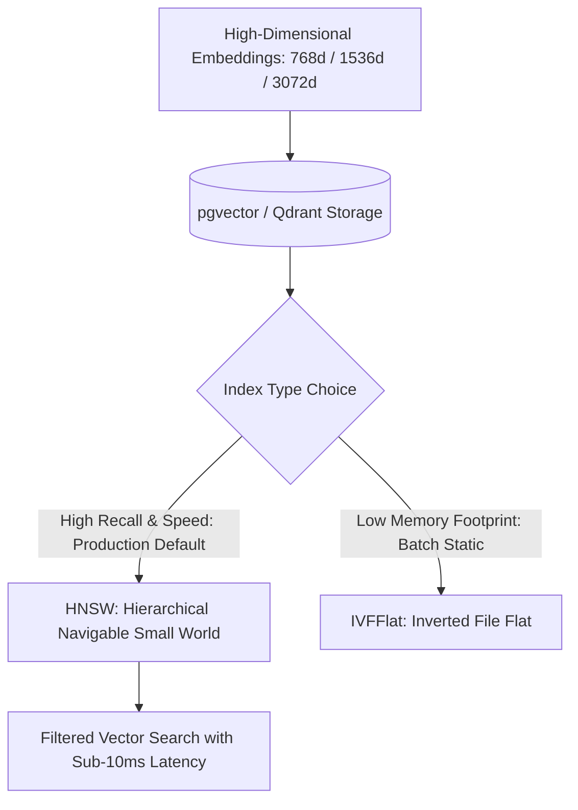

# Vector Databases & pgvector / Qdrant Master

This skill provides enterprise standards for architecting, indexing, and optimizing vector similarity search databases for AI embeddings.

---

## 📐 Vector Indexing & Architecture (HNSW vs IVFFlat)

---

## 🎯 Production Invariants

1. **HNSW Over IVFFlat for Production**: Always use HNSW index (`m = 16`, `ef_construction = 64`) for live apps; IVFFlat degrades recall as data grows.
2. **Metadata Co-location**: Store vector embeddings in the same relational row as metadata in PostgreSQL (pgvector) to avoid distributed network hops.
3. **Normalized Dot Product (`<=>`)**: For unit-normalized embeddings, use inner product (`<#>`) or cosine distance (`<=>`) consistently.

---

## 📋 Prosedur Eksekusi

1. **Panduan Indexing HNSW**:
   - Baca [references/hnsw-indexing-tuning.md](./references/hnsw-indexing-tuning.md).
2. **Template Schema pgvector**:
   - Rujuk [resources/schema.sql](./resources/schema.sql).
3. **Audit Indeks Vektor**:
   - Jalankan `python3 skills/vector-db-pgvector-qdrant-master/scripts/check-vector-index.py`.
