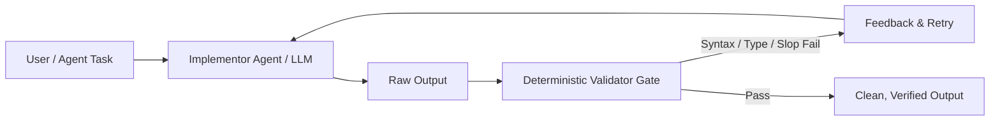

# Automated Anti-Slop Verification Harness

The CIV (Coordinator-Implementor-Verifier) pattern ensures that generated code and text pass deterministic gates before reaching production or user review.

## Gate Checklist
1. **Linter / Type-checker pass**: `tsc --noEmit`, `mypy --strict`, `cargo check`, or `go vet`.
2. **Regex Slop Scanner**: Reject outputs containing banned regex tokens.
3. **No Dead Placeholders**: Verify that `TODO: implement`, `FIXME: add rest`, or `// ...` do not exist in committed changes.
