# Voice & Multimodal Agent Orchestrator Master

This skill provides industry standards for building ultra-low-latency real-time voice and multimodal AI agents with WebRTC audio streaming, voice activity detection (VAD), and vision analysis.

---

## 🎙️ Real-Time Voice Agent Architecture

```mermaid
graph LR
    User[User Microphone] -->|WebRTC Opus Audio Stream| VAD[Voice Activity Detection: Silero VAD]
    VAD -->|Active Speech| STT[Fast STT: Deepgram Nova-3 / Whisper]
    STT -->|Streaming Text| LLM[LLM Streaming Reasoning: Gemini / Claude]
    LLM -->|Streaming Tokens| TTS[Ultra-Fast TTS: ElevenLabs / Cartesia]
    TTS -->|Raw Audio Buffer| Speaker[User Speaker: Sub-500ms Turnaround]
```

---

## 🎯 Production Invariants

1. **Sub-500ms End-to-End Latency**: Stream LLM tokens directly to TTS sentence-by-sentence rather than waiting for complete responses.
2. **Barge-in / Interruptibility**: Automatically cancel TTS audio buffers and LLM generation the instant user speaks (VAD trigger).
3. **Multimodal Image Pre-processing**: Compress and normalize images to max 1568px on the longest edge before sending to vision APIs.

---

## 📋 Prosedur Eksekusi

1. **Panduan WebRTC Audio Streaming**:
   - Baca [references/webrtc-voice-streaming.md](./references/webrtc-voice-streaming.md).
2. **Template Voice Agent**:
   - Rujuk [resources/audio-agent.ts](./resources/audio-agent.ts).
3. **Uji Latensi Audio**:
   - Jalankan `bash skills/voice-multimodal-agent-orchestrator/scripts/test-audio-latency.sh`.
