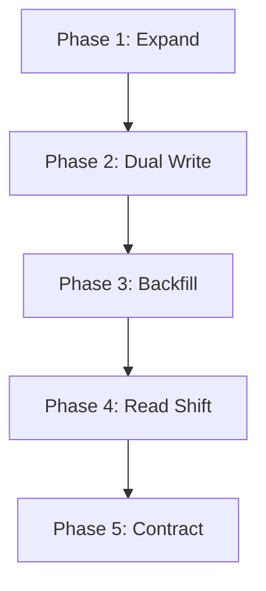

# Zero-Downtime Database Migration (Expand-Contract Pattern)

When making breaking schema changes (e.g. renaming column `full_name` to `first_name` + `last_name`):

1. **Phase 1 (Expand)**: Add new columns as nullable in the database.
2. **Phase 2 (Dual Write)**: Application code writes to both old and new columns.
3. **Phase 3 (Backfill)**: Run asynchronous background job to migrate historical rows in batches.
4. **Phase 4 (Read Shift)**: Update application to read exclusively from the new column.
5. **Phase 5 (Contract)**: Drop deprecated column and remove legacy code.
